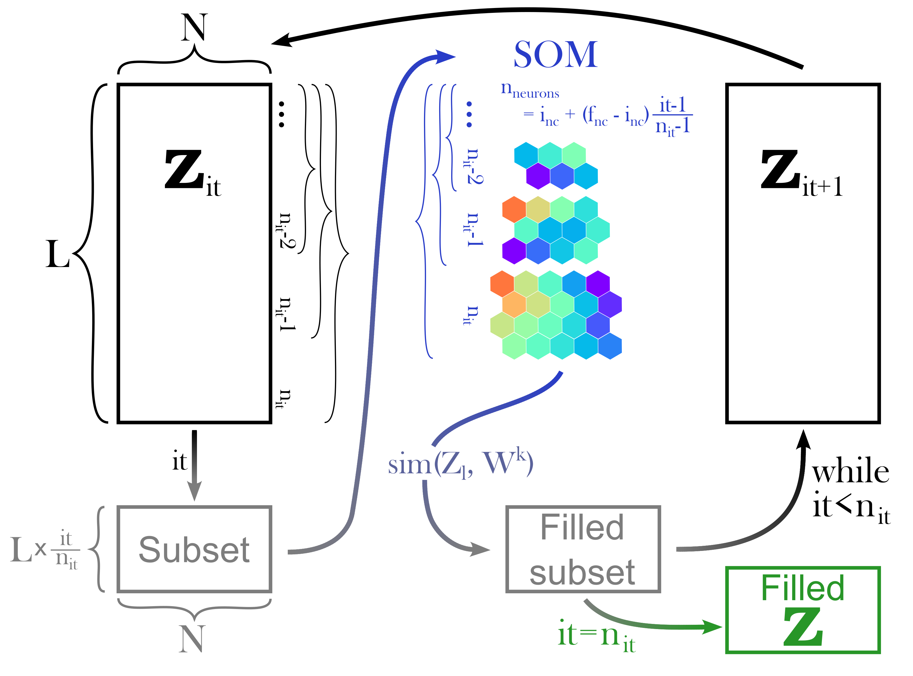

# **A self-organising map algorithm**
This repository contains an implemention of the Self-Organising Map (SOM) algorithm and an implemention of the ITCOMPSOM method in Python. The latter is a method to iteratively fill missing values in a dataset using SOMs.

{\color{red}\mathbf{Note of caution:}} The examples applying the SOM and ITCOMPSOM algorithms provided in this repository are only for illustration purposes. Generally, careful hyperparameter tuning is necessary, such that good results are obtained while not overfitting the training data! This was not considered for the presented examples.

---
## **Self-Organising Maps**
### Background
A Self-Organising Map (SOM) is an unsupervised machine learning algorithm that is used to reduce the dimensionality of high-dimensional datasets to a (typically) two-dimensional neural map. During this process, the topological structure of the data is preserved, i.e. neural classes of similar data are near each other, while dissimilar classes are separated in the two-dimensional space (Kohonen, 1982). Therefore, the neural maps are referred to as topological maps in the following. The topological map consists of a preset number of classes or neurons $nc$ that are connected to each other by a neighbourhood relation. The neighbourhood relation depends on the type of lattice (either rectangular or hexagonal) and its shape (either planar or toroidal). Each neuron is characterised by a referent or weight vector $\mathbf{W^k}$, which consists of the same number of variables, hereafter referred to as features, as the input dataset. A sample of the input dataset $\mathbf{Z_l}$ can be attributed to a neuron $c_l$, which then is referred to as best-matching unit (BMU), according to the Euclidean distance $\lVert \cdot \rVert$ between the sample and the weight vectors of the topological map, i.e.
$$c_l = argmin_{k \in [1,...,nc]} \left( \lVert \mathbf{Z_l} - \mathbf{W^k} \rVert   \right)$$
After the SOM is initialised using random values, the topological map is trained for several iterations or epochs, during which the weight vectors are adjusted according to the input dataset. Each epoch generally consists of determining the BMU of an input sample and then adjusting the values of the weight vectors. The adjustment of the weight vectors does not only include the BMU, but also affects neurons of the topological map in the neighbourhood of the respective BMU. The spatial range of neurons around the BMU that are subject to the adjustment is determined by a neighbourhood kernel function. Additionally, the neighbourhood kernel function causes neurons that are farther away from the BMU to be less affected by the adjustment compared to neurons in close vicinity of the BMU. In the present case, a Gaussian neighbourhood kernel function is used, defined as
$$h_{k, c_l}(t) = \exp \left( \frac{-\lVert \mathbf{r_c} - \mathbf{r_k} \rVert^2}{2\sigma^2(t)} \right)$$
where $\mathbf{r_c}$ is the location of the BMU $c_l$ on the topological map, $\mathbf{r_k}$ are the locations of the respective other neurons, and $\sigma(t)$ is the neighbourhood radius at epoch $t$. The neighbourhood radius is chosen such that a wide area of the topological map is adjusted during early stages of the training process and then gradually reduced. The neighbourhood radius at epoch $t$ is defined as
$$\sigma(t) = \sigma_1 \exp \left( -\beta t \right)$$
where $\sigma_1$ is the neighbourhood radius during the first epoch and $\beta$ is a decay rate. The adjustment of the weight vectors in this implementation makes use of a batch algorithm, which replaces the weight vectors by the weighted average of the input samples. The weight function is determined by the neighbourhood kernel function (Vatanen et al., 2015). Thus, the updated weight vector $\mathbf{W^k}(t + 1)$ is defined as
$$\mathbf{W^k}(t + 1) = \frac{\sum_{j = 1}^N h_{k, c_l}(t) \mathbf{Z_l}}{\sum_{j = 1}^N h_{k, c_l}(t)}$$
where $N$ is the number of sample vectors in the input dataset.

### The `Self_Organising_Map` class
The implementation of the SOM algorithm is accessible through the `Self_Organising_Map` class, which allows to specify the parameters of the topological map, as well as the training process. Furthermore, methods are available to analyse and evaluate the SOM. An option is available to perform the computations using a dask cluster to apply the algorithm to larger datasets. If a dask cluster is used, the chunk sizes can either be provided by the user or set automatically based on the size of the input dataset.

Different options for the topological map are available. The topological map can either have a rectangular or a hexagonal grid. For the former a grid cell has eight direct neighbours, while for the latter a grid cell has six direct neighbours. The shape of the topological map can either be planar or toroidal, i.e. wrapping around in both directions. The toroidal shape has the benefit of avoiding boundary effects (Ultsch & Herrmann, 2005). The planar hexagonal grid can furthermore be shaped as a rectangle, a rhombus, or a hexagon. The size of the topological map can be set either through specifying the number of rows and number of columns, or through specifying the approximate number of grid cells. In the latter case, the number of rows and columns is determined based on the ratio between the two largest eigenvalues of the training dataset (Vatanen et al., 2015).

Once the `Self_Organising_Map` object is compiled, the SOM can be trained using an input dataset. For the training process, the number of epochs can be specified, as well as the neighbourhood relation. Here, the initial neighbourhood radius $\sigma_1$ needs to be set, as well as either the decay rate $\beta$ or the final neighbourhood radius ($\beta$ is then computed internally). Consecutive calls of the `train` method continues the training process from the last status of the SOM. Training parameters (number of epochs and neighbourhood relation) can be changed in between calls to `train`. To restart the training process, the `Self_Organising_Map` object needs to be re-compiled by calling the `compile` method, which resets the topological map. The SOM and the relevant parameters can be stored to a NetCDF file using the `SOM_to_netcdf` method. The thus created file can be used to initialise the `Self_Organising_Map` from a file via the `init_from_file` method, therefore allowing to do further analyses at a later point without the need to train a new SOM.

Once a SOM is trained, the BMUs for the samples of a given dataset can be determined via the `predict` method. The accuracy of the predictions can be assessed via the `evaluate` method. For this purpose, each sample in the dataset must be associated with a "label". The Davis-Bouldin index can be computed as well, which can be used as in indicator of the performance in terms of clustering. It is computed by calling the `Davis_Bouldin_Index` method. Ultsch & Mörchen (2005) presented three tools for visualising the clusters of a SOM, termed the *U-matrix*, *P-matrix*, and *U\*-matrix*. These can be computed by calling the `compute_umatrix`, `compute_pmatrix`, and `compute_ustarmatrix`, respectively. The U-matrix gives the local distance structure at each neuron. It is calculated as the sum of the distances between a SOM class and all of its immediate neighbours. The P-matrix gives the local data density at each neuron. It is calculated as the number of data points within a defined hypersphere around each neuron. The U\*-matrix is a scaled version of the U-matrix, allowing for a more clear depiction of cluster boundaries. The values of the U-matrix are dampened in highly dense regions, unaltered in regions of average density and emphasised in sparse regions. Each matrix is normalised by its maximum value, such that the values range from $0$ to $1$.

To visualise the topological map the `Self_Organising_Map` object includes the `visualise_SOM` method, which allows to quickly plot the map on its native grid. For more customising options, an additional function `plot_map_strucuture` is available. This function can also be used to plot the U-, P-, or U\*-matrix.

The included Jupyter notebook *example_SOM.ipynb* illustrates the general usage of the SOM implementation. The algorithm is applied exemplarily to the chain link dataset  (Ultsch, 1995), representing two intertwined three-dimensional rings.

---
## **Iterative completion using Self-Organising Maps**
### Background
A SOM can be used to fill in missing values of an input dataset by determining the BMU of a sample vector and substituting its missing features for the corresponding features of the BMU (e.g. Charantonis et al., 2015; Chapman & Charantonis, 2017; Puissant et al., 2021; Sloyan et al., 2023). In this case, the Euclidean distance is modified to only consider existing features in the sample vector. This is also referred to as truncated distance. The truncated distance is further modified by weighting the distance computation by the correlation between the available and the missing features. This means that if a feature is missing in a sample, those features that generally correlate more strongly with the missing feature are more relevant in the BMU search compared to the features that generally correlate less strongly. Therefore, the weighted truncated distance, referred to as similarity function in the following, can be calculated as
$$
sim(\mathbf{Z_l}, \mathbf{W^k}) = \sum_{n \in obs_l} \left[
    \left( 1 + \sum_{m \in miss_l} (cor_{n, m})^2 \right)
    \times (z_{j, n} - w_n^k)^2
\right]
$$
where $obs_l$ corresponds to the existing features in sample vector $\mathbf{Z_l}$, while $miss_l$ corresponds to the missing features. $cor$ is an $N \times N$ matrix, where $N$ is the number of features in $\mathbf{Z}$. This matrix contains the Spearman correlation coefficients between each pair of features in $\mathbf{Z}$. It is computed prior to applying the ITCOMPSOM method.

|  | 
|:---| 
| Schematic of the ITCOMPSOM method to fill in missing values in a given dataset. $\mathbf{Z}$ is the input data matrix. $N$ is the number of features, and $L$ is the number of samples. $it$ is the current iteration, $n_{it}$ is the total number of iterations, $i_{nc}$ and $f_{nc}$ are the initial and final number of neurons on the topological map (SOM), respectively. $sim\left( \mathbf{Z_l}, \mathbf{W^k} \right)$ is the similarity function used to determine the best matching unit for a given sample containing missing values. For $it = n_{it}$, i.e. after the final iteration, the "Filled subset" corresponds to the full dataset $\mathbf{Z}$ with all missing values filled in. Adapted from "Application of Machine Learning Techniques to Ocean Mooring Time Series Data" by Sloyan et al. (2023), Fig. 5. |

Based on this approach an iterative method was designed, where missing values are filled using progressively larger topological maps that are trained on increasingly larger subsets of the input dataset (illustrated in the schematic above). This method, referred to as ITCOMPSOM (iterative completion using Self-Organising Maps), has successfully been applied to various datasets, including glider data (Charantonis et al., 2015), deep current velocities (Chapman & Charantonis, 2017), the vertical distribution of phytoplankton in the water column (Puissant et al., 2021), and a mooring array in the East Australian Current (Sloyan et al., 2023). For this method, the input data is combined into a matrix $\mathbf{Z}$ of shape $N \times L$, where $N$ is the number of features and $L$ is the number of samples, and sorted by the number of missing values per sample. Then for a given number of iterations $n_{it}$ a subset of $\mathbf{Z}$ of size $L \times \frac{it}{n_{it}}$ is selected, where $it \in [1, ..., n_{it}]$ is the current iteration. A SOM is trained on this subset and afterwards the missing values in the subset are filled using the BMUs of the respective samples. At the following iteration, i.e. $it + 1$, the subset therefore consists of previously completed data and new data still containing missing values. Therefore, missing values in $\mathbf{Z}$ are filled multiple times until after the last iteration all missing values in $\mathbf{Z}$ are filled using the classes of the final SOM. In a last step, $\mathbf{Z}$ is reordered. As the subsets used to train the topological maps become progressively larger, also the size of the topological map, i.e. the number of classes or neurons, is adjusted at each iteration. The number of classes is incrementally increased from an initial value of $i_{nc}$ to a final value of $f_{nc}$, such that the number of neurons at iteration $it$ is $n_{neurons} = i_{nc} + (f_{nc} - i_{nc}) \frac{it - 1}{n_{it} - 1}$. Following Vatanen et al. (2015), the shape of the topological map, i.e. the number of rows and columns, is determined by the ratio between the two largest eigenvalues of the input dataset.

### The `ITCOMPSOM` class
The implementation of the ITCOMPSOM method is accessible through the `ITCOMPSOM` class. This class makes use of the `Self_Organising_Map` class described above. Therefore, specifying the parameters for the topological maps and the training process is similar for the `ITCOMPSOM` class. Similarly, a dask cluster can be used for larger datasets. Methods directly accessible through the `ITCOMPSOM` object that are inherited from the `Self_Organising_Map` class, are the `predict`, `evaluate`, `Davis_Bouldin_Index`, `compute_umatrix`, `compute_pmatrix`, `compute_ustarmatrix`, and `visualise_SOM` methods.

Before applying the ITCOMPSOM method, the input data needs to be pre-processed. This includes normalising the dataset, computing the correlation between each pair of features in the input dataset, and sorting the dataset by the number of missing values per sample. The computed correlations are used when determining the BMUs in order to fill in missing values. The pre-processing is performed by calling the `preprocessing` method. To perform the iterative gap filling, the `run` method is used. At this point the parameters for the SOM and the training parameters are set, as well as the number of iterations. It is also possible to supply a list of training parameters, i.e. number of epochs and neighourhood relation. This allows to separate the training process of the SOM (at each iteration of the ITCOMPSOM method) into different phases, e.g. a rough training phase with larger neighbourhood radii and faster decay rate, and a fine training phase with smaller radii and slower decay rates.

After each iteration, the results are stored into NetCDF files at a location specified by the user. These files can be used to restart the computation from a previous iteration (`restart_from_file` method). In order to use the `evaluate` method, labels need to be associated with the samples and the topological map. For the ITCOMPSOM algorithm, the labels need to be assigned to the SOM after training the SOM. The `assign_labels_to_SOM` method determines the BMU for each sample in the input dataset. The label of a grid cell is determined as the most common label at that cell corresponding to the given input data. For SOM grids with more classes than input samples, the labels are attributed based on their neighbourhood.

The included Jupyter notebook *example_ITCOMPSOM.ipynb* illustrates the general usage of the ITCOMPSOM implementation. the algorithm is applied to an example dataset consisting of different sine waves.

---
## **References**
> Chapman, C. & Charantonis, A. A. (2017). Reconstruction of Subsurface Velocities From Satellite Observations Using Iterative Self-Organizing Maps. *IEEE Geoscience and Remote Sensing Letters, 14 (5)*, 617–620. doi:[10.1109/LGRS.2017.2665603](https://www.doi.org/10.1109/LGRS.2017.2665603)
>
> Charantonis, A. A.; Testor, P.; Mortier, L.; D’Ortenzio, F. & Thiria, S. (2015). Completion of a Sparse GLIDER Database Using Multi-iterative Self-Organizing Maps (ITCOMPSOM). *Procedia Computer Science, 51*, 2198–2206. doi:[10.1016/j.procs.2015.05.496](https://www.doi.org/10.1016/j.procs.2015.05.496)
>
> Kohonen, T. (1982). Self-organized formation of topologically correct feature maps. *Biological Cybernetics, 43*. doi:[10.1007/BF00337288](https://www.doi.org/10.1007/BF00337288)
>
> Puissant, A.; El Hourany, R.; Charantonis, A. A.; Bowler, C. & Thiria, S. (2021). Inversion of Phytoplankton Pigment Vertical Profiles from Satellite Data Using Machine Learning. *Remote Sensing, 13 (8)*. doi:[10.3390/rs13081445](https://www.doi.org/10.3390/rs13081445)
>
> Sloyan, B. M.; Chapman, C. C.; Cowley, R. & Charantonis, A. A. (2023). Application of Machine Learning Techniques to Ocean Mooring Time Series Data. *Journal of Atmospheric and Oceanic Technology, 40 (3)*, 241–260. doi:[10.1175/JTECHD-21-0183.1](https://www.doi.org/10.1175/JTECHD-21-0183.1)
>
> Ultsch, A. (1995). Self organizing neural networks perform different from statistical k-means clsutering. *Gesellschaft f. Klassifikation*. (Basel, 8th-10th March)
>
> Ultsch, A. & Herrmann, L. (2005). The architecture of emergent self-organizing
maps to reduce projection errors. *Proceedings of the European Symposium on
Artificial Neural Networks (ESANN 2005)*, 1–6.
> 
> Ultsch, A. & Mörchen F. (2005). ESOM-Maps: Tools for clustering, visualization, and classification with Emergent SOM.
>
> Vatanen, T.; Osmala, M.; Raiko, T.; Lagus, K.; Sysi-Aho, M.; Orešic, M.; Honkela, T. & Lähdesmäki, H. (2015). Self-organization and missing values in SOM and GTM. *Neurocomputing, 147*, 60–70. doi:[10.1016/j.neucom.2014.02.061](https://www.doi.org/10.1016/j.neucom.2014.02.061)